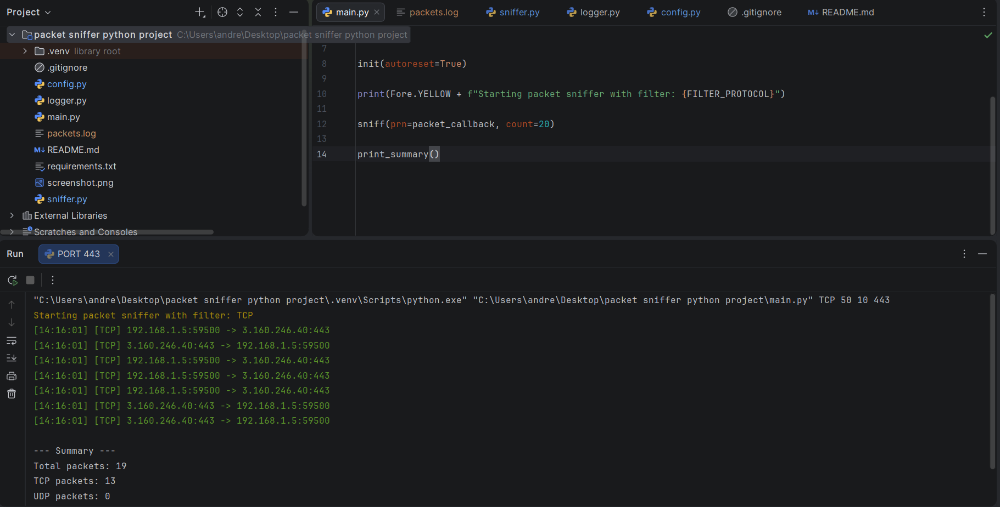

# Packet Sniffer (Python)

A Python-based network packet sniffer that captures, filters, and logs network traffic in real time.  
Supports protocol filtering (TCP/UDP), command-line configuration, and persistent logging for later analysis.

---

## Features

- Capture live network packets using Scapy
- Filter traffic by protocol (TCP / UDP)
- Display source/destination IPs and ports
- Log captured packets to a file (`packets.log`)
- Command-line configuration:
  - Protocol selection
  - Packet count
  - Timeout duration
- Summary statistics after execution

---

## Tech Stack

- Python
- Scapy
- Colorama
- Git

---

## How It Works

The application listens for incoming and outgoing packets on your network interface.  
Each packet is analyzed to extract relevant information such as:

- Source IP
- Destination IP
- Source port
- Destination port
- Protocol type

Filtered packets are:
1. Displayed in the terminal (color-coded)
2. Logged to a file for later inspection

---

## Installation

1. Clone the repository:

```bash
git clone https://github.com/andreicalin7/packet-sniffer.git
cd packet-sniffer

## Example Output


